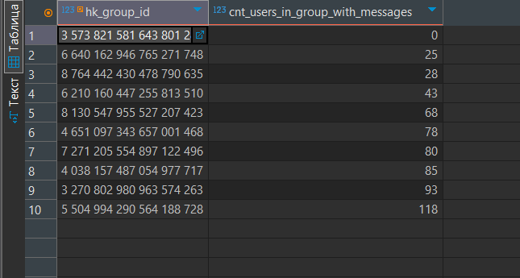
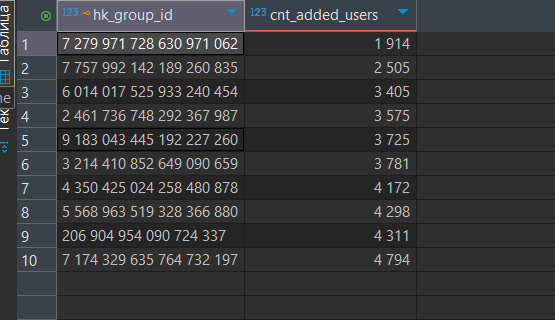
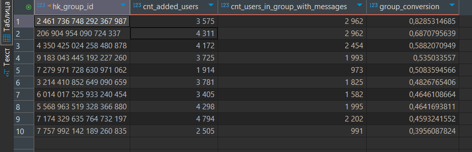

# Проектная работа по аналитическим базам данных

## Описание проекта

Данный проект реализует ETL-процесс для обработки и анализа данных о действиях пользователей в группах. Основная задача — перенести данные из файла `group_log.csv` (S3) в слой staging, затем в слой DDS, и рассчитать ключевые конверсионные метрики для групп.

## Описание данных

Файл `group_log.csv` содержит логи событий пользователей в группах со следующими полями:

- **group_id** — уникальный идентификатор группы
- **user_id** — уникальный идентификатор пользователя
- **user_id_from** — идентификатор пользователя, который добавил другого пользователя в группу (если применимо)
- **event** — тип события:
    - `create` — пользователь создал группу
    - `add` — пользователь вступил сам или был добавлен в группу
    - `leave` — пользователь покинул группу
- **datetime** — время совершения события

## Этапы реализации

1. **Загрузка данных из S3 в staging-слой**
    - Импорт новых данных из файла `group_log.csv` в таблицу staging.
    - Валидация и базовая очистка данных.

2. **Создание таблиц в постоянном хранилище (DDS)**
    - Создание таблиц для хранения обработанных данных по заданной схеме.
    - Перенос данных из staging в DDS.

3. **Расчёт аналитических метрик**
    - Для 10 самых старых групп рассчитываются:
        - `user_group_messages` — активные пользователи
        - `user_group_log` — количество пользователей, вступивших в группы
        - `group_conversion` — общий запрос

## Структура проекта

Результат вывода запросов: 

1. 

2. 

3. 
